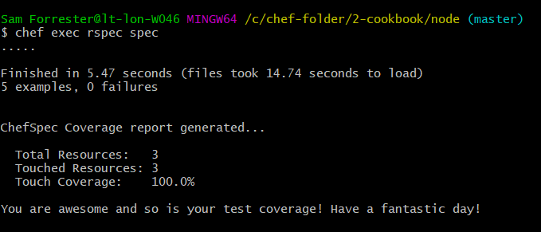

# :fork_and_knife: Chef Cookbook Set-Up :fork_and_knife:
- _This walkthrough assumes successful installation and license acceptance of chef tool_
- _You can check that you have chef installed by executing in your command line:_
      chef -v

## Starting Out
To make a new cookbook, execute:

    chef generate cookbook <cookbook_name>

where <cookbook_name> is what you'd like to call your cookbook! :tongue:   

This creates a new folder in the directory you executed the command in, with whatver name you gave it (i.e. \<cookbook_name\> in the above command).

Let's enter the folder, using:

    cd \<cookbook_name\>

and hit a **cheeky ls** to have a look at what we've just made. :spaghetti:

You'll see a whole host of files and sub-directories, but don't be alarmed, there's only a few of them we need to worry about at this stage. :poultry_leg:

The most important, that we're going to cover in this walkthrough, are the files:
1. kitchen.yml
2. Policyfile.rb

and inside the sub-directories:

3. recipes/default.rb
4. spec/spec_helper.rb & spec/unit/recipes/default_spec.rb
5. test/integration/default/default_test.rb

You'll notice the file types are predominantly ruby (_.rb_ files), this is because chef operates on ruby language, mixing it with it it's own language, making it a _Domain Specific Language_.

The .yml file is code written in YAML format, a human readable language often used for congifuration. YML/YAML stands for "_yet another mark-up language_".

It is this kitchen.yml file that we shall consider first... :curry:

Go ahead and on the cookbook directory you just made, open up your files with a:

    atom .

### :meat_on_bone: Set-up your kitchen with kitchen.yml :hamburger:

Open up your kitchen.yml file and take a look. This is where the brunt of the set up for your _kitchen_ will take place. A kitchen is simply a place (or virtual environment) where your cookbook can exist and do its thing. :pizza:

We're going to be using vagrant to run our machines to being with at least, so make sure that and virtual box are installed. This is what the driver section at the top of this file are for. Moving on.

In this file, we can decide which operating system we'd like our kitchen to use (since it is a virtual machine, after all) as well as what provisioning we'd like to occur and what integration tests we'd like to perform (more on those later).

We need to make some changes to this file to get it to the level we'd like.

We need to tell our system to accept the chef license, as well as which files to use as provisioning for the system. _Provisioning_ is essentially pre-setting up our environment so it contains the necessary things we need to carry out the processes we want it to. This is usually, but not limited, to the installation of various packages.

In chef cookbooks, our recipes are our provisioning files. So, we need to direct our kitchen to these recipe files so that it can carry them out and set-up the system to our specifications. :fried_shrimp:

This section under "provisioner:" is where we accept the license and direct it to our recipes for provisioning. Thus, it should look a little bit like:
```ruby
    provisioner:
      name: chef_zero
      chef_license: accept
      policyfile_path: path_to_recipe_file
```

where \<path_to_recipe_file\> specifies the path to our recipe file. In initial set-up, this will look like: \<cookbook_name>/Policyfile.rb.

N.B. _You may not have to define your path to Policyfile, as it should be able to see where it is on default set-up._

Next, to the platforms section. This is where we define which operating system we'd like to run on our kitchen virtual machine.

Using Ubuntu 16.04 as an example, I have included an excerpt of code that should appear in this file to specify which operating system. You will need to change this to your own specifications and OS choice, as well as knowing what command is used for this in vagrant (i.e. where it states the box as ubuntu/xenial64):

```ruby
    platforms:
      - name: ubuntu-16.04
        driver:
          box: ubuntu/xenial64
```

It's important to note the indentation throughout. While ruby does not rely on correct indentation to work, like python for instance, it is always helpful to maintain the indentation as it can be useful when identifying syntax errors.

We can move past the verifier and suites sections of this file, they are more advanced settings. The suites section specifies which integration tests to carry out, but we won't change this as we will simply be editing the file that it is directed to already with our own tests.

### :dango: Recipes :oden:
As previously mentioned, recipes are carried out in the kitchen to provision processes automatically, usually to get your machine to install certain packages for use later.

Open up the recipe file in \<cookbook_name\>/recipes/default.rb.
Here we can write code in ruby/chef language to install and perform actions on packages automatically upon initiation of our machine. In theory, we can make more than one recipe and tell our kitchen to carry out multiple recipes at once, but in this instance we shall just edit the default recipe.

Here's an example of code we can input to provision the installation of the package "nginx":
```ruby
    package 'nginx'
```

Yes, it is that simple. Chef's special ruby hybrid language takes care of the hard stuff for us.

Here is some futher code to provision the enablement and start of the nginx service. This looks a little bit more ruby-esque.
```ruby
    service 'nginx' do
      action :enable
    end

    service 'nginx' do
      action :start
    end
```

This is perhaps a bit more specific to the package of nginx and what it requires to start, but it can be extended to other packages you'd like to provision the installation of.

### :egg: Policyfile.rb :stew:
We mentioned the Policyfile earlier, this section should explain a bit better what it is for. Go ahead and open it up have a look.

Chef has been pretty helpful here, as there are comments to explain what each line does - it even gives you a weblink to go have more of a look yourself. So we'll be a bit brief about it.

The name is pretty self explanatory, give it a good name so you (and others) know what it's for.

The default_source line is a reference for where to get external cookbooks for. This is beyond the scope of what we're doing here, as it's a bit more advanced.

The run_list section is probably the most important and relevant here right now. It tells your kitchen which recipes to run, and in what order. If we had made multiple recipes here, and I'm sure you will at some point, this is where we tell it which ones to run, and in what sequence. Recipes should ideally be split up to separate the installation and manipulation of different packages.

The final section, by default, defines the location of the current cookbooks. This is again beyond the scope of this walkthrough, but if you wished to integrate different external cookbooks, this might be a good place to look.

## Create Kitchen and run our Recipes
We're now ready to execute commands to create our kitchen (a virtual machine), and execute those recipes for our provisioning. In your command line:

Creating the kitchen:

    kitchen create

Run the recipes (provisioning):

    kitchen converge

This will result in making our virtual machine to the specifications we designed upon set up of those three files we've just discussed.

After this, we can move on to some testing.

### :bread: default_spec.rb :rice:

The default_spec.rb file, stored in spec/unit/recipes (important to distinguish this between the recipes directory with default.rb in it) is where we can run some unit tests in our kitchen.

Unit tests are for testing the code in our system, as opposed to integration tests that test the capability of the environment we've made. More on that later.  

Based off of the recipe I described earlier, we're going to test the recipes we've written. So we're going to test that:
1. We are using Ubuntu 16.04
2. We have installed, enabled and started nginx

This is going to use chef's ruby hybrid language that is surprisingly human readable. The following is what they should look like:
```ruby
require 'spec_helper'

describe 'node::default' do
  context 'When all attributes are default, on Ubuntu 16.04' do
    # for a complete list of available platforms and versions see:
    # https://github.com/chefspec/fauxhai/blob/master/PLATFORMS.md
    platform 'ubuntu', '16.04'

    it 'converges successfully' do
      expect { chef_run }.to_not raise_error
    end

    it 'Should install nginx' do
      expect(chef_run).to install_package 'nginx'
    end

    it 'Enables the nginx service' do
      expect(chef_run).to enable_service 'nginx'
    end

    it 'Starts the nginx service' do
      expect(chef_run).to start_service 'nginx'
    end

  end
end
```

This looks a bit daunting if you don't know ruby, but it's not that bad.

require 'spec_helper' refers to another file in the above folder that is used to assist these tests.

The first test can be altered to change first the output text for a failure (next to 'context'), and the actual test needs to be changed on the 'platform' line to test the OS you actually installed.

The next lines follow a similar syntax in the sense that the first line merely states a string that is used to describe the test, it doesn't come into play in the actual test. Theoretically we could write anything in there, but it's useful to make it relevant as that is what will come up if the code fails the tests, so you know what didn't pass.

The tests use a ruby loop to occur, and you should be able to see how each line uses its built in phrases and syntax to test the code. This can be altered to write tests for other packages and recipes.

The 'converges successfully' line is for testing the kitchen converge command when it is used. Don't worry too much about knowing how everything works, as all that's needed to be done is edit existing syntax to test other recipes.

### :rice_ball: spec_helper :rice_cracker:

Your spec_helper file will contain something like this:

```ruby
require 'chefspec'
require 'chefspec/policyfile'
```
It is a list of requirements to run the tests in default_spec.rb. We can customise it by adding:

```ruby
at_exit { ChefSpec::Coverage.report! }
```
to produce a simple report on tests and their coverage at the end of a test.

We are now ready to run some tests!

So, with your kitchen created and converged (see earlier), in our command line, we can run:

    chef exec rspec spec

to run ruby's special rake spec tests. It knows which folder to run it on because of the "spec" component. It should look something like this on output:



This will display how well your tests have done.

### :sushi: default_test.rb :bento:
In this file, we can specify integration tests for how our machine is operating.
We can test if nginx is running, and whether it is listening on port 80. This is a bit beyond the scope of this course so we'll leave it here for now.

#### :icecream: Thank you for listening to my ted talk. :doughnut:
